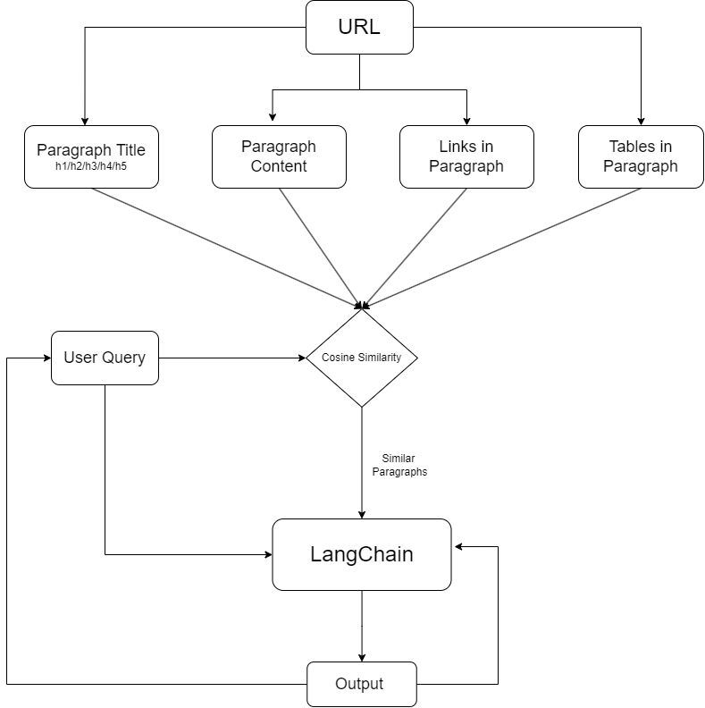
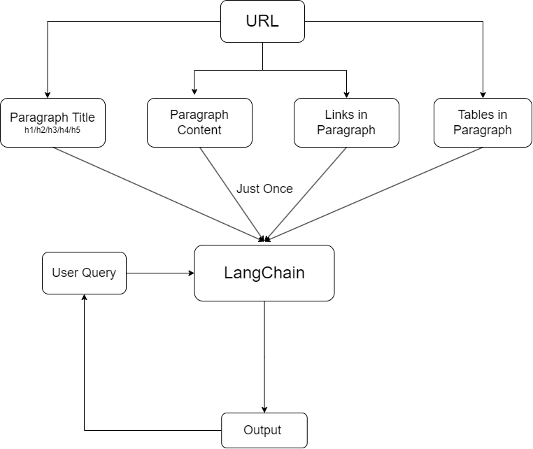

# Natural Language Query Agent

## LLMS Used

Here for the query agent, I used the LangChain LLM provided by [Gorq](https://console.groq.com/). This LLM enables conversational capabilities by maintaining chat history and offering features like managing conversational history and more.

This is like a custom LLM for particular use cases in which data is provided by the user and required answers from that data.

<I>**I used this basic LLM model of LangChain because I used it earlier sometime, of course, it does not have capabilities like the recent LLMs like Gemini, ChatGPT, and Llama. Using my approach for creating personal agents can produce excellent results with these new models. I just focussed best approach on how to make the best results rather than choosing the best LLM model, as the problem statement states to solve the issue with the best approach, not the best model.**</I>

## Raw Data Organization


I have designed this project to handle a variety of web URLs and README files, extracting relevant data to be organized for effective management and processing by LLMs (Language Models). Here's how it works:
1. **URL and README Parsing**: The system retrieves content from provided web URLs and README files.
   
2. **HTML Content Extraction**: Using tools like BeautifulSoup, the project extracts text, tables, and URLs embedded within HTML pages. This content is organized into structured data types such as paragraphs, tables, and lists.

3. **Preprocessing**:
Text can be processed but LangChain has 8b tokens and is designed to execute the different characters, hence there is not much necessity of processing the textual data, other than some major preprocessing.

4. **Organized Data Structure**: After extraction and preprocessing, data is structured into:
   - **Paragraphs**: Sequential blocks of text, ensuring readability and logical flow.
   - **Tables**: Extracted tabular data formatted for easy interpretation.
   - **Embedded URLs**: Links within text are extracted and categorized for further reference or processing.

5. **Global Applicability**: The system is designed to generalize across various web sources and README formats, ensuring adaptability and scalability for different data structures and languages.


## Approach

### Step 1: 
To generalize the use of URLs for this personal query agent, I've implemented a BeautifulSoup function. It processes HTML content, capturing text between `<h>` tags as paragraphs. Each paragraph is represented as a map structured as follows:
- The script fetches HTML content from a specified URL (`url`).
- BeautifulSoup parses the HTML, identifying headings (`<h1>` to `<h6>`).
- It extracts text content between headings as paragraphs, capturing relevant `<a>` tags as links within each section.
- Each paragraph is structured into a map (`paragraph_map`) containing `title`, `content`, `page_url`, `relevant_links`, and `paragraph_number`.
- This approach provides a clear and organized way to handle and process data extracted from various web sources.

```python
{
    'title': 'Title of the Web Page or Document',
    'content': 'Content of the paragraph extracted from the page',
    'page_url': 'URL of the page or document where the paragraph was extracted from',
    'relevant_links': ['List', 'of', 'relevant', 'links', 'found', 'within', 'the', 'paragraph'],
    'paragraph_number': 1  # Sequential number of the paragraph within the document
}
```

### Step 2: Providing Data to the Model

In Step 2, the approach involves feeding extracted data to the model for processing user queries. There are two primary approaches explored:

#### Approach 1: Batch Processing with Cosine Similarity
In this method, data is provided batch by batch to the model based on user input queries. Here's how it works:
- **Data Feeding**: Extracted paragraphs and relevant links are stored.
- **User Query Handling**: When a user query is received, it is compared using cosine similarity against the content of paragraphs.
- **Top Matching Paragraphs**: The top `n` paragraphs with the highest cosine similarity scores are selected and provided as input to the model.
- **Advantages**: Provides precise results based on textual similarity to the user query.
- **Disadvantages**: Dependency on textual matching; if words don't match, relevant results may not be displayed.



#### Future Approach: Vector Space Comparison
An alternative future approach could involve using vector space models:
- **Vector Representation**: Each paragraph is represented as a vector in a high-dimensional space.
- **Query Comparison**: User queries are also converted into vectors.
- **Similarity Calculation**: Compute the similarity between the query vector and paragraph vectors to select the most relevant `n` paragraphs.
- **Advantages**: Potentially more robust to semantic meaning rather than just textual overlap.
- **Consideration**: Implementation complexity and computational overhead must be managed.
```diff
- This is the scaling approach for 1st method, as using vector spaces will correct the data matching.
```

#### Approach 2: Full Data Feeding to LLMs
In this approach, all extracted data is provided at once to the Language Models (LLMs) for processing:
- **Data Preparation**: Data from all URLs is structured and formatted before feeding into LLMs.
- **Query Handling**: LLMs are tasked to answer user queries directly based on the pre-fed data.
- **Advantages**: Comprehensive data context available for responses.
- **Disadvantages**: Dependency on LLM capabilities; may not scale well with large datasets or require powerful LLMs.



CustomGPT by OpenAI works similarly by providing the entire data at once to the model, hence generating answers based on provided data, but have similar drawbacks.

```diff
- The scaling approach for this method is using strong LLMs with huge tokens and more tends towards the conversational history.
```

### Conclusion
Both approaches have distinct advantages and drawbacks based on the data's nature and the query agent's requirements. Future improvements could explore hybrid approaches or enhancements in model capabilities to handle larger datasets effectively.


## Fulfillment of Requirements
- [x] Personal Conversation agent
- [x] Organized web articles
- [x] Pipeline/Architecture
- [x] Cite References (Both Approaches)
- [x] Conversational Memory
- [x] Generate a summary after a series of questions
